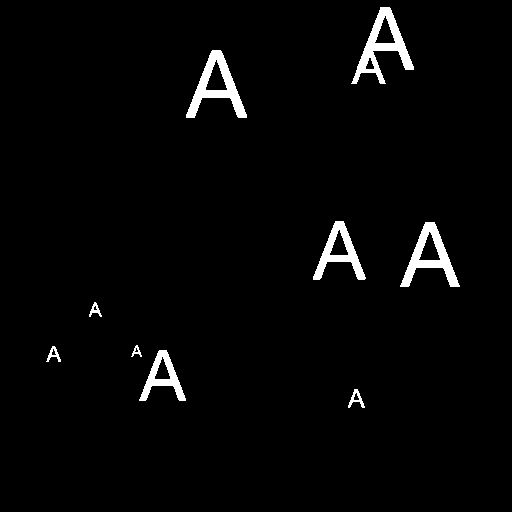
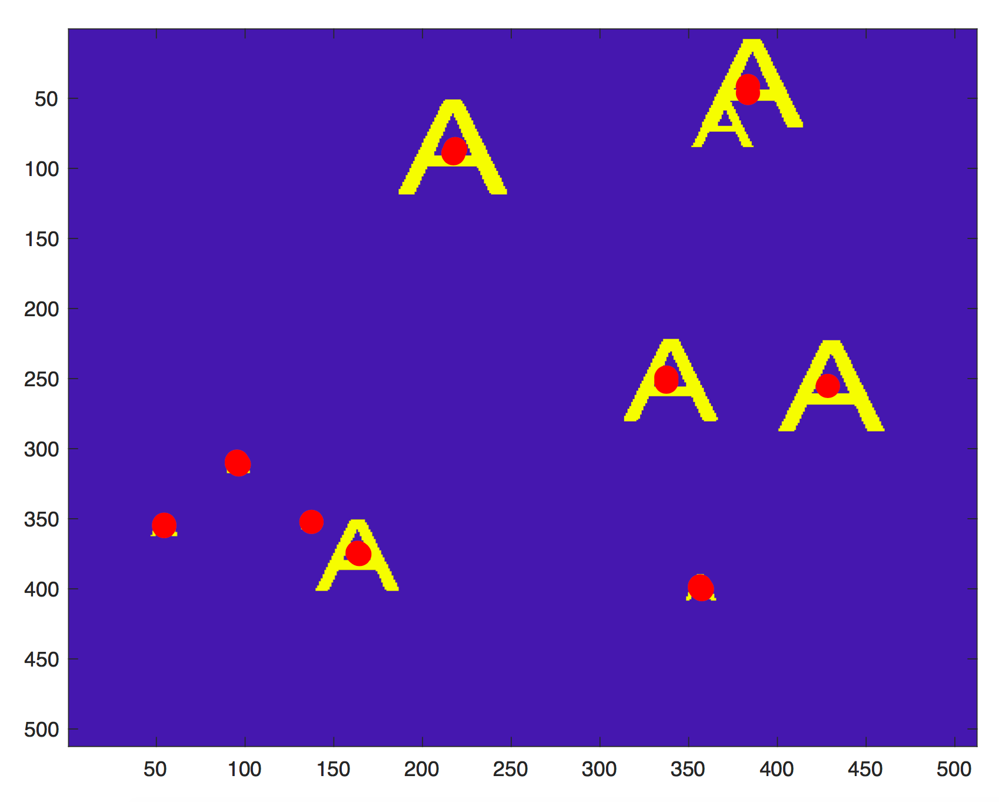

# Image Tracker

Image pyramids are useful whenever we want to analyze an image at different scales. We can create an image stack where each image level is a blurred version of the previous level. Here I used a Gaussian kernel for blurring, and bilinear interpolation for sampling.

### Using a Gaussian Image Pyramid, I tracked all the "A"s in an image.
Original image

Template

Original image tracked with red dots

